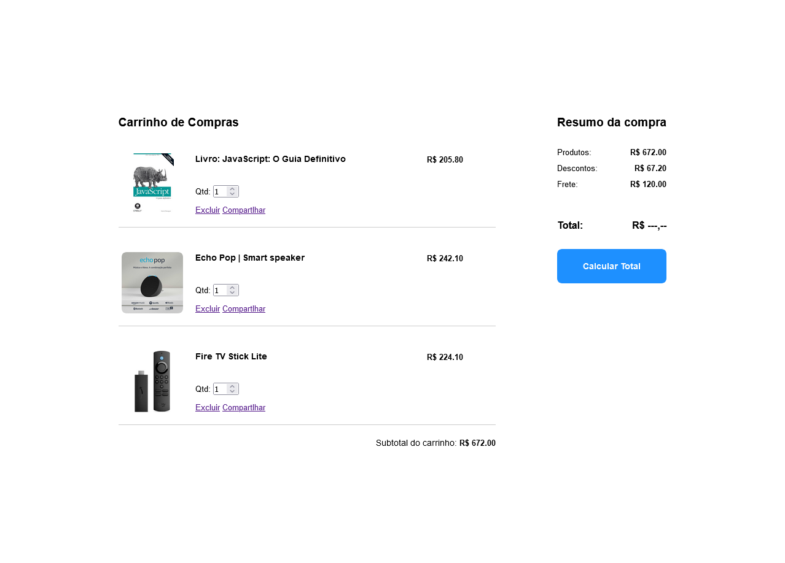
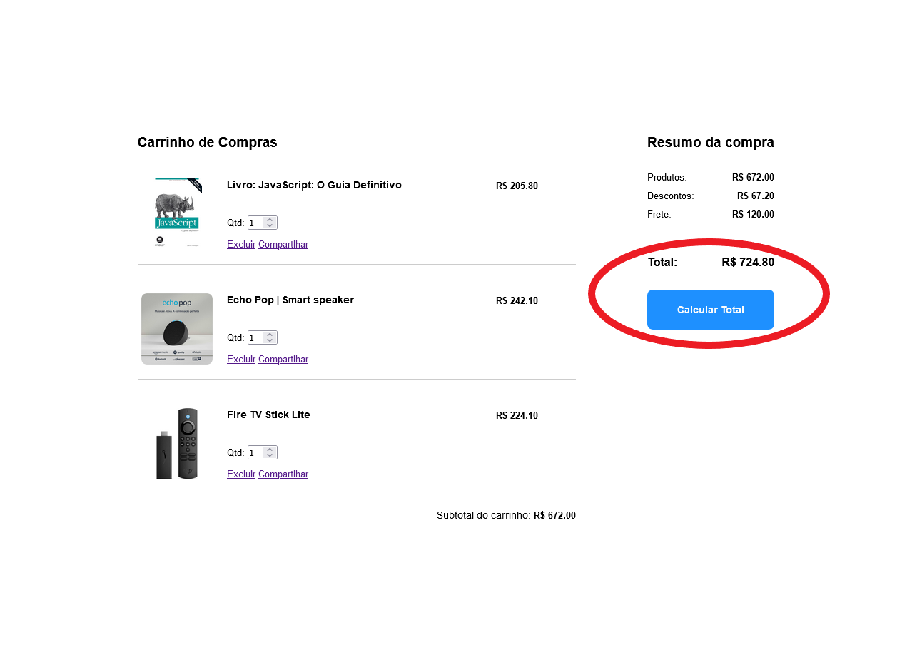

# Prática Avaliativa Final - N1

> Esta atividade tem como objetivo integrar os conhecimentos adiquiridos até aqui na disciplina de Desenvolvimento Web I

## Requisitos e Instruções para Realização da Atividade

- Esta atividade tem como objetivo integrar diversos conhecimentos adiquiridos até aqui na disciplina de Desenvolvimento Web I, como: JavaScript Básico, ES6 e JavaScript DOM.

- A atividade consiste em implementar um sistema simplificado de carrinho de compras, como mostrado na imagem a seguir:

    

- [Acesse aqui](https://drive.google.com/file/d/1putRp50HekI6zOVXFfNbFMm8ll4eT59c/view?usp=sharing) um vídeo com uma demonstração rápida do funcionamento esperado ao final da implementação de todas as funcionalidades.

- **Instruções e recursos:**
    - A atividade é baseada no exemplo iniciado em sala de aula, onde o código está disponível em: https://codepen.io/lucasifce/pen/eYodppe
    - Use o exemplo acima para entender a estrutura que a página deve ter com todos os elementos renderizados;
    - Use o código base, disponivel [neste link](https://codepen.io/lucasifce/pen/wvZrZMX) como ponto de partida;
    - Perceba que no código base, no link acima, a estrutura HTML traz somente as divs correspondentes à listagem dos itens no carrinho e ao resumo da compra. Todos os demais conteúdos devem ser renderizados de forma dinâmica usando JavaScript com manipulação do DOM.

- **Requisitos para a avaliação:**

    - (**2 scores**) Todos os itens devem ser carregados dinamicamente, de acordo com os dados do array `carrinho`;
    - (**1 scores**) O subtotal do carrinho deve ser calculado no carregamento da página e exibido nos locais adequados (perceba que o subtotal também deve aparecer no resumo da compra);
    - (**1 scores**) Os valores de desconto e frete devem ser exibidos no resumo, também ao carregar a página;
    - (**2 scores**) O valor total da compra (aplicando o desconto e o frete) só deve ser exibido quando o usuário clicar no botão "Calcular Total", como apresentado na imagem a seguir:
    
    - (**2 scores**) Ao modificar a quantidade de um determinado item no carrinho, os dados referentes ao valor final do item, subtotal do carrinho e desconto devem ser atualizados na página;
    - (**2 scores**) Ao excluir um item ele deve ser deletado da visualização da página e todos os valores de subtotal do carrinho e desconto devem ser atualizados (verifique mais uma vez o [vídeo de demonstração](https://drive.google.com/file/d/1putRp50HekI6zOVXFfNbFMm8ll4eT59c/view?usp=sharing)).
