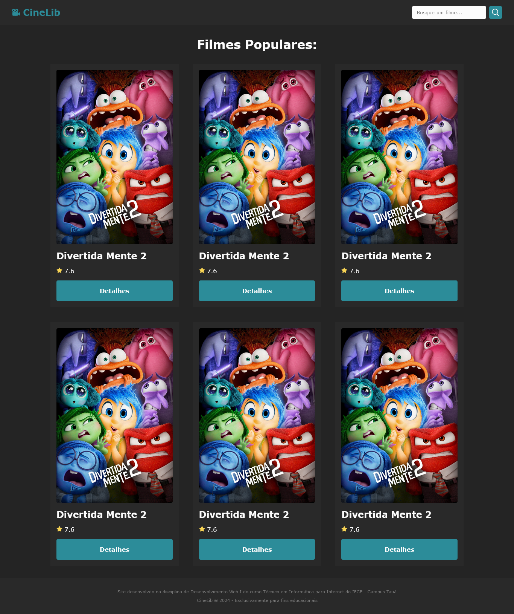
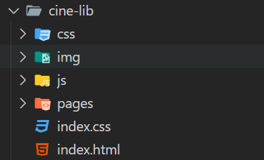
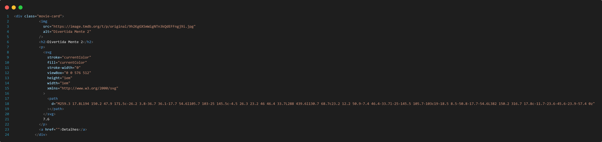

# Prática 01 - N2

> Esta atividade tem como objetivo implementar a lógica necessária para realizar o consumo de uma API de filmes, tratar e apresentar os dados retornados em uma aplicação web front-end.

## Requisitos e Instruções para Realização da Atividade

- Nesta atividade vocês vão utilizar os conceitos de programação assíncrona, promises, requisições HTTP com a função fecth e manipulação do DOM da página.

- A atividade consiste em implementar um sistema simples de listagem de filmes populares com base em dados disponibilidados pela API do [TMDB](https://developer.themoviedb.org/reference/intro/getting-started), como na imagem a seguir:

    

- **Instruções e recursos:**

  - A atividade deve ser realizada a partir do código-base disponível neste repositório, na pasta a seguir: [cine-lib](cine-lib/)
  - O código-base está organizado da seguinte maneira:

    - Uma pasta para os arquivos css de cada componente e/ou página
    - Uma pasta img para as imagens necessárias
    - Uma pasta pages para outras páginas além da inicial
    - Uma pasta js para os scripts da aplicação
    - O arquivo index.html definindo a página inicial e o arquivo index.css com a estilização global

      

  - Toda a estrutura HTML e o CSS global já estão definidos. Logo, nesta atividade vocês deverão criar um arquivo de código JavaScript que implemente a comunicação com a API do TMDB (como visto em aula) e busque pelos filmes populares, exibindo-os na página, utilizando conceitos de manipulação do DOM.

  - A estrutura para cada card de filme que deve ser incluído na div com id `.movies-container` é a seguinte:
    - O card será definido com uma div com a classe `.movie-card`
    - Dentro do card devem estar a imagem de divulgação do filme, um título h2 com o nome do filme, um parágrafo com o ícone de estrela e a nota média de avaliação do filme e, por fim, um link estilizado como botão com o texto "Detalhes".

    

  - Para realizar esta prática você deve excluir ou comentar a estrutura estática que está dentro da div com classe `.movies-container` e criar essa estrutura de forma dinâmica através do código em JavaScript. Criando a estrutura de acordo com o modelo estático apresentado anteriormente, os estilos já serão aplicados.

  - Lembrem-se de utilizar os exemplos construíudos em aula, bem como os materiais de estudos como base para esta atividade.
