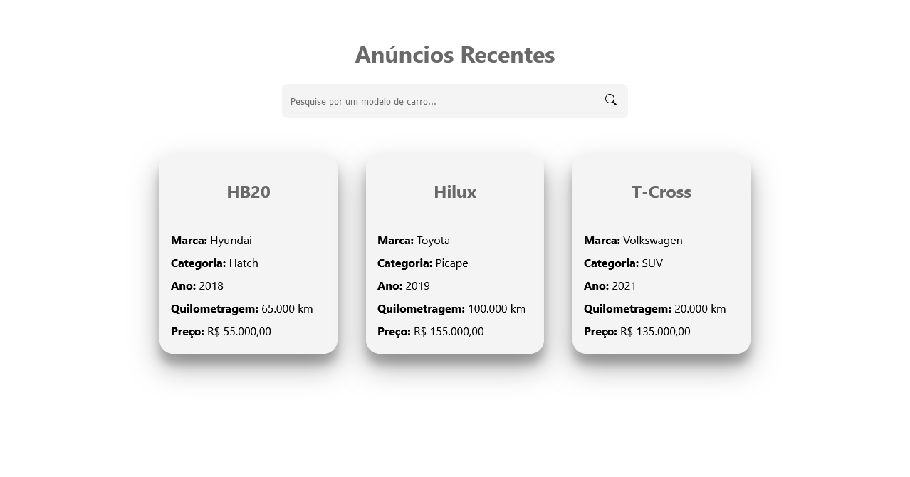

# Desenvolvimento Web I - Infonet 2024.1

## Roteiro de Prática

> **_Prática React 01_** - *Primeiros passos com React*
>
> - **Objetivo:** ter o primeiro contato com os conceitos principais da biblioteca [React](https://react.dev/) para construção de interfaces de usuário dinâmicas e reativas.
> - **Observações e Instruções Gerais:**
> 	- tente seguir o roteiro desta prática de forma a entender cada passo.
>  	- Caso fique com alguma dúvida, fique à vontade para perguntar.
>   	- Você também pode verificar o código final da prática [neste link](app-react-01) (porém, entenda que esse é um recurso auxiliar, tente realizar a prática somente seguindo este roteiro).
>    	- Os códigos CSS podem ser simplesmente copiados e colados (não é o foco da nossa disciplina). Já para os códigos JavaScript e JSX, implemente cada passo no seu computador sem utilizar CTRL C + CTRL V 😉.

1. Inicialmente é necessário instalar a plataforma [Node.js](https://nodejs.org/pt/download/package-manager), caso ainda não esteja instalada.

1. Para criar um novo projeto React podemos utilizar a ferramenta [Vite](https://vitejs.dev/).

   - Crie uma pasta para organizar os projetos e abra ela no VS Code
   - Abra o terminal integrado na pasta criada (botão direito na área da pasta no explorador de arquivos do VS Code)
   - Digite o comando `npm create vite@latest` para criar um novo projeto com o Vite
   - Caso seja a primeira vez usando o Vite, o node fará a instalação dessa ferramenta
   - Você deverá fornecer um nome para o projeto (por exemplo, `app-react-01`)
   - Depois você deve selecionar a biblioteca React e a linguagem JavaScript para que o Vite crie adequadamente o projeto para nossa necessidade, dentro de um pasta com o nome atribuído ao projeto

1. Entre na pasta do projeto, pelo terminal, usando o comando `cd nome_da_pasta`

1. Instale as dependências iniciais do projeto usando o Node Package Manager (npm), com o comando `npm install`

   - Esse comando irá procurar e instalar no projeto todas as dependências definidas a partir dos arquivos package.json e package-lock.json

1. Execute o projeto usando o comando `npm run dev`

   - A aplicação será aberta em um navegador (se não abrir, confira o URL local da aplicação no terminal) e o Vite fará **_Hot Module Replacement_** quando algum componente for modificado (atualização automática e instantânea da aplicação)
   - Observe no navegador a aplicação criada por padrão pelo Vite, depois volte para o VS Code e observe a estrutura de diretórios e arquivos do projeto

   <div style="width: 50%; margin: 0 auto">
       
   </div>

1. Agora vamos entender os principais arquivos e diretórios do projeto criado, semelhante à imagem abaixo (abra os arquivos e confira seu conteúdo):

   <div style="width: 50%; margin: 0 auto">
       
   </div>

   - **_node_modules_** - pasta onde são instaladas as dependências do projeto
   - **_public_** - Recuros estáticos e públicos da aplicação
   - **_src_** - pasta raíz do código-fonte da aplicação
   - **_index.html_** - HTML raíz da aplicação (página de inicialização)
   - **_package.json_** - arquivo de manifesto do projeto, com metadados, definição de dependências e scripts
   - **_src/main.jsx_** - arquivo de inicialização do React
   - **_src/App.jsx_** - componente principal da aplicação que será renderizado no elemento _root_ definido no arquivo HTML de inicialização (_index.html_)

1. Importante destacar que o arquivo `.gitignore` especifica arquivos que devem ser ignorados pelo Git. Perceba que dentro dele há a indicação da pasta `node_modules`, o que significa que essa pasta não será versionada pelo Git. Logo, para abrir seu projeto corretamente em outro computador (caso utilize o Git para versionar o projeto e hospede-o no GitHub, por exemplo) você deve executar o comando `npm install` na pasta do projeto para que o npm instale e gerencie todas as dependências necessárias.

   - Isso é importante, pois geralmente são gerados muitos arquivos de módulos e dependências dentro da pasta node_modules e não é necessário versionar esses arquivos já que podemos recriar todo o conteúdo da pasta node_modules a partir do arquivo `package.json`

1. Antes de começar a alterar os arquivos do projeto, veja o resultado final esperado para a aplicação a ser desenvolvida nesta prática:

   <div style="width: 50%; margin: 0 auto">
       
   </div>

   - Trata-se de um exemplo simples de listagem de anúncios de carros, onde as informações sobre cada carro anunciado aparecerão em um card na página inicial
   - Além disso, será possível realizar uma pesquisa pelo modelo do carro através da barra de pesquisa superior
   - Analisando a imagem acima, podemos pensar nossa aplicação de forma componentizada onde teremos 3 componentes: a própria página inicial (`App.jsx`), o card para cada carro e a barra de pesquisa

1. No arquivo `index.html` altere o título da página e o idioma (`pt-BR`)

1. No arquivo `index.css`, apague o conteúdo já existente e aplique os estilos gerais da aplicação, como a seguir:

   ```css
   * {
     box-sizing: border-box;
   }

   body {
     margin: 0;
     padding: 0;
     font-family: system-ui, -apple-system, BlinkMacSystemFont, "Segoe UI", Roboto,
       Oxygen, Ubuntu, Cantarell, "Open Sans", "Helvetica Neue", sans-serif;
   }
   ```

1. No arquivo `App.jsx` apague as importações que não vamos precisar (deixe somente a importação do arquivo App.css), modifique o corpo da função App() apagando a linha contendo `const [count, setCount] = useState(0)` e tudo que está dentro do fragment `<></>`

1. Ainda no arquivo `App.jsx` vamos criar um título `h1` e uma `div` com a classe `cards`, onde ficarão os cards com informações de cada carro

   - Inicialmente o arquivo `App.jsx` deve ficar assim:

   ```javascript
   import "./App.css";

   const App = () => {
     return (
       <>
         <h1>Anúncios Recentes</h1>
         <div className='cards'>Lista de Carros...</div>
       </>
     );
   };

   export default App;
   ```

   - Se, no seu caso, o componente App foi criado usando a definição tradicional de função (`function App() {...}`), pode alterar para a definição baseada em _arrow function_, como apresentado acima.

   - O código dentro do `return` da função `App` é um código [JSX](https://react.dev/learn/writing-markup-with-jsx) que define os elementos que compõe o componente `App`. Perceba que é um código semelhante a um código HTML, porém também podemos declarar códigos JavaScript, como veremos mais adiante.

   - Por restrições do próprio React, todo o código JSX dentro do `return` deve estar dentro de um único elemento pai. Para isso, geralmente colocamos um componente _fragment_ (`<></>`) como elemento pai.

1. Substitua o conteúdo do arquivo `App.css` pelos estilos que devem ser aplicados à página inicial da aplicação, como a seguir:

   ```css
   #root {
     max-width: 1280px;
     margin: 0 auto;
     padding: 2rem;
     display: flex;
     flex-flow: column nowrap;
     place-items: center;
   }

   .cards {
     display: flex;
     flex-flow: row wrap;
     justify-content: space-around;
     width: 100%;
     margin: 30px 0;
   }

   h1 {
     color: dimgray;
     text-align: center;
   }
   ```

1. Agora que já temos a estrutura básica da página inicial, vamos criar nossos componentes para os cards e para a barra de pesquisa. Para isso, vamos criar uma pasta chamada `components` dentro da pasta `src`.

1. Inicialmente vamos definir o componente para o card:

   - Crie um arquivo chamado `Card.jsx` e outro chamado `Card.css`
   - No arquivo `Card.jsx` vamos importar o arquivo de estilos: `import "./Card.css"`
   - Depois, vamos criar uma constante com o mesmo nome do arquivo (`Card`) para guardar a definição do componente com _arrow function_, criando a estrutura necessária ao componente.
   - Por fim, devemos exportar o componente para que possamos reutilizá-lo em outros locais.
   - O código final do componente `Card` é o seguinte:

   ```javascript
   import "./Card.css";

   const Card = ({ car }) => {
     return (
       <div className='card'>
         <h2>{car.model}</h2>
         <ul>
           <li>
             <span>Marca:</span> {car.brand}
           </li>
           <li>
             <span>Categoria:</span> {car.category}
           </li>
           <li>
             <span>Ano:</span> {car.year}
           </li>
           <li>
             <span>Quilometragem:</span> {car.km} km
           </li>
           <li>
             <span>Preço:</span> R$ {car.price}
           </li>
         </ul>
       </div>
     );
   };

   export default Card;
   ```

   - Perceba que na definição da função do componente `Card` estamos recebendo um argumento `{ car }`.
     - Chamamos esse argumento de **_props_**.
     - [O React usa **_props_**](https://react.dev/learn/passing-props-to-a-component) para passar informações de um componente para outro.
     - Nesse casso, o componente pai do componente `Card` deve passar um objeto com informações de um carro (`car`). Desse objeto, recuperamos os atributos: `brand`, `category`, `year`, `km` e `price` e utilizamos seus valores na definição do código JSX do componente.
     - Para executar algum código JavaScript (como acessar um atributo de um objeto) dentro do código JSX, devemos colocá-lo entre chaves `{}`, como em `{car.brand}`.

1. Vamos definir as regras de estilo para o componente card, no arquivo `Card.css`, como a seguir:

   ```css
   .card {
     width: 250px;
     border-radius: 20px;
     background-color: #f4f4f4;
     box-shadow: rgba(0, 0, 0, 0.3) 0px 19px 38px, rgba(0, 0, 0, 0.22) 0px 15px 12px;
     padding: 1rem;
     transition: all 0.5s;
     margin: 20px;
   }

   .card:hover {
     transform: scale(1.04);
     cursor: pointer;
   }

   .card h2 {
     font-weight: bold;
     text-align: center;
     border-bottom: 1px solid #e4e4e4;
     padding-bottom: 1rem;
     color: dimgray;
   }

   .card ul {
     list-style-type: none;
     padding: 0;
     margin: 0;
     line-height: 2;
   }

   .card li span {
     font-weight: bold;
   }
   ```

1. Agora, voltando para o arquivo `App.jsx`, vamos fazer duas coisas:

   - Criar um array de objetos para simular informações de carros recuperadas de um banco de dados, por exemplo (perceba que na prática, esses dados deveriam vir de um banco de dados ou API)
   - Importar nosso componente `Card` para utilizá-lo na página inicial

   ```javascript
   import "./App.css";

   import Card from "./components/Card";

   const listCars = [
     {
   	id: 1,
   	brand: "Hyundai",
   	model: "HB20",
   	km: "65.000",
   	category: "Hatch",
   	year: "2018",
   	price: "55.000,00",
     },
     {
   	id: 2,
   	brand: "Toyota",
   	model: "Hilux",
   	km: "100.000",
   	category: "Picape",
   	year: "2019",
   	price: "155.000,00",
     },
     {
   	id: 3,
   	brand: "Volkswagen",
   	model: "T-Cross",
   	km: "20.000",
   	category: "SUV",
   	year: "2021",
   	price: "135.000,00",
     },
   ];

   const App = () => {
   ...
   ```

1. Vamos incluir dentro do componente `App` (página inicial) um componente `Card` para cada carro no nosso array de carros.

   - Logicamente, não vamos inserir o componente `Card` várias vezes em nosso código de forma estática (até porque não sabemos quantos carros seriam retornados em uma aplicação real).
   - **_Como faremos então?_**
     - Lembra dos métodos de iteração em arrays? Pois é, eles serão úteis aqui, principalmente o método `map()`
   - O código JSX (dentro do `return`) do componente `App` ficará assim:

   ```javascript
   ...
   return (
   	<>
   	  <h1>Anúncios Recentes</h1>
   	  <div className='cards'>
   		{listCars.map((car) => (
   		  <Card key={car.id} car={car} />
   		))}
   	  </div>
   	</>
     );
   ...
   ```

   - Vamos entender o código acima:

     - Inicialmente, como queremos executar um código javascript, inserimos a chamada ao método `map` dentro de chaves `{}` para percorrer todos os elementos do array `cars`

     - Em cada iteração no array chamamos o elemento atual de `car`, que representa um objeto com informações de um carro.

     - No corpo da função executada no método `map`, colocamos o código JSX para criar um componente `Card` com as informações de cada carro.

     - O atributo `key` é uma restrição do próprio React (sempre devemos definir esse atributo quando trabalhamos com lista de elementos de mesmo tipo). Aqui simplesmente passamos o ID do carro, o que já é suficiente para diferenciar um elemento do outro dentro dessa lista.

     - O atributo `car` é a **_prop_** que definimos para o componente `Card`, como já discutido no passo 16. Aqui passamos o objeto `car` que contém todos os atributos necessários para renderizar o componente `Card`.

1. Já conseguimos listar todos os carros na página inicial em formato de cards, agora vamos trabalhar com o componente da barra de pesquisa. Para isso, crie os arquivos `SearchBar.jsx` e `SearchBar.css` dentro da pasta `components`.

1. Para definir o ícone de pesquisa no campo de busca, vamos utilizar a biblioteca `react-icons`. Dessa forma, abara o terminal integrado do VS Code na pasta do projeto e execute o comando `npm install react-icons`.

1. Agora, vamos trabalhar no arquivo `SearchBar.jsx`:

   - Importe o ícone `BsSearch` da biblioteca `react-icons`: `import { BsSearch } from 'react-icons/bs'`
   - Importe o arquivo de estilos do componente: `import "./SearchBar.css"`
   - Declare a função que define o componente, dando o nome de `SearchBar` e incluindo um formulário com a classe `search-container` contendo um elemento `input` e um `button` com o ícone `BsSearch`
   - O código inicial do componente deve ficar assim:

   ```javascript
   import { BsSearch } from "react-icons/bs";
   import "./SearchBar.css";

   const SearchBar = () => {
     return (
       <form className='search-container'>
         <input type='text' placeholder='Pesquise por um modelo de carro...' />
         <button type='submit'>
           <BsSearch />
         </button>
       </form>
     );
   };

   export default SearchBar;
   ```

1. No arquivo `SearchBar.css` vamos definir o css do componente de barra de pesquisa, como a seguir:

   ```css
   .search-container {
     width: 40%;
     background-color: #f4f4f4;
     border-radius: 8px;
     display: flex;
   }

   .search-container input[type="text"] {
     padding: 16px 12px;
     flex-grow: 1;
     background-color: transparent;
     border: none;

     &:focus {
       outline: none;
     }
   }

   .search-container button {
     width: 48px;
     background-color: transparent;
     border: none;
     cursor: pointer;
     border-radius: 8px;
     font-size: 1rem;

     &:hover {
       background-color: #e2e2e2;
     }
   }
   ```

1. Agora precisamos definir a ação que vai acontecer quando o usuário digitar alguma coisa no campo de busca e clicar no botão de pesquisa. O código do arquivo `SearchBar.jsx` ficará assim, após as modificações explicadas a seguir:

   ```javascript
   import { useState } from "react";
   import { BsSearch } from "react-icons/bs";
   import "./SearchBar.css";

   const SearchBar = ({ handleSearch }) => {
     const [query, setQuery] = useState("");

     const handleSubmit = (e) => {
       e.preventDefault();
       handleSearch(query);
     };

     return (
       <form className='search-container' onSubmit={handleSubmit}>
         <input
           type='text'
           placeholder='Pesquise por um modelo de carro...'
           value={query || ''}
           onChange={(e) => setQuery(e.target.value)}
         />
         <button type='submit'>
           <BsSearch />
         </button>
       </form>
     );
   };

   export default SearchBar;
   ```

    - Inicialmente definimos que o nosso componente agora recebe uma função chamada `handleSearch` como **_prop_** (poderia ser qualquer nome, mas geralmente seguimos essa convensão: `handle`+Nome_da_acao).

        - Essa função será passada pelo componente pai (`App`) porque é ele quem sabe como executar a pesquisa dentro dos registros de carros.

    - Utilizamos um conceito muito importante do React, que é o [conceito de `Hooks`](https://pt-br.react.dev/reference/react/hooks)
        - Veremos esse conceito com calma, mas de início tenha em mente que os Hooks nos fornecem recursos úteis e poderosos do React para utilizarmos em nossas aplicações
        - No nosso exemplo, usamos o Hook `useState`. Ele serve para "lembrar" de uma informação que nossa aplicação pode receber e utilizar em diferentes momentos.
        - Nesse caso, usamos o `useState` para definir um estado chamado `query` que vai armazenar o texto que o usuário digitar no campo de busca. 
        - Para definir um estado com o `useState` precisamos dar um nome para o estado e um nome para uma função que altera esse estado, da seguinte forma: — `const [query, setQuery] = useState("");`
    
    - Criamos uma função chamada `handleSubmit` que define o que vai ocorrer quando o usuário submeter os dados do formulário de pesquisa (quando clicar no botão com ícone de busca)
        - Nessa função, inicialmente pegamos o evento (`e`) e chamamos o método `preventDefault()` para evitar que o navegador tente recarregar a página (lembre-se que com o React, não queremos esse comportamento de reload da página)
        - Depois, chamamos a função que faz a busca (aquela que recebemos do componente pai por meio de props) passando o estado `query` como argumento (já que ele guarda o que o usuário digitar no campo de busca)
    
    - Além disso, no JSX do componente `SearchBar` temos as seguintes alterações:
        - Passamos a função `handleSubmit` para o evento `onSubmit` do formulário (assim, estamos dizendo ao React o que será executado quando o formulário for submetido)
        - No elemento input passamos a `query` como valor do campo (atributo `value`) para não perder o que o usuário digitar e sempre aparecer essa informação no campo de busca (enquanto não limparmos ele)
        - Ainda no elemento input perceba o seguinte trecho: `onChange={(e) => setQuery(e.target.value)}`
            - Aqui, estamos declarando que quando houver uma modificação no valor do campo (`onChange`) uma função será executada (`(e) => setQuery(e.target.value)`) para atualizar o estado `query` com o novo valor digitado pelo usuário (assim, sempre teremos o estado atualizado)

1. Por último (finalmente 😅), valtaremos ao arquivo `App.jsx` para inserir o componente `SearchBar` e implementar a função que executa a busca a partir do que o usuário digitar no campo de busca.

    - O código do componente `App` será modificado como a seguir:

    ```javascript
   import { useState } from "react";

    import "./App.css";

    import Card from "./components/Card";
    import SearchBar from "./components/SearchBar";
    [...]
    const App = () => {
	    const [cars, setCars] = useState(listCars);

        const handleSearch = (query) => {
            if (query === '') {
                setCars(listCars);
                return;
            }		

		    setCars(listCars.filter(car => car.model.includes(query)));
	    }
	
    [...]
	    <h1>Anúncios Recentes</h1>
        <SearchBar handleSearch={handleSearch} />
        <div className='cards'>
            {cars.map((car) => (
                <Card key={car.id} car={car} />
            ))}
        </div>
    [...]
   ```

    - Inicialmente, importamos o hook `useState`, pois vamos precisar para armazenar a lista de carros que será apresentada na página.

    - Depois, importamos o componente `SearchBar` para utilizá-lo na página inicial.

    - Agora, definimos o estado `cars` com o hook `useState`, bem como a função para modificá-lo — `const [cars, setCars] = useState(listCars)`.

    - Implementamos então a função de pesquisa, chamando ela de `handleSearch`

        - Primeiro verificamos se a `query` (termo de pesquisa) que o usuário digitou é vazia. Se for, simplesmente definimos o estado `cars` pegando toda a lista de carros (array `listCars`) e encerramos a função (`return`).

        - Caso o usuário tenha pesquisado por algum termo, definimos o estado `cars` filtrando o array `listCars` com o método `filter`, verificando se o modelo (`model`) do carro inclue (`includes`) o termo pesquisado (`query`) — `setCars(listCars.filter(car => car.model.includes(query)))`

    - Perceba que no JSX do componente `App` incluímos o componente `SearchBar` passando a função `handleSearch` como prop para ele (que será executada quando o usuário clicar no botão de pesquisa) — `<SearchBar handleSearch={handleSearch} />`.

    - Por fim, na div `cards`, ao invés de chamarmos o método `map` a partir do array `listCars`, chamamos a partir do array no estado `cars` (pois é ele que guarda a lista de carros que deve ser exibida, com base na pesquisa feita pelo usuário):
    ```html
    <div className='cards'>
        {cars.map((car) => (
            <Card key={car.id} car={car} />
        ))}
    </div>
    ```
