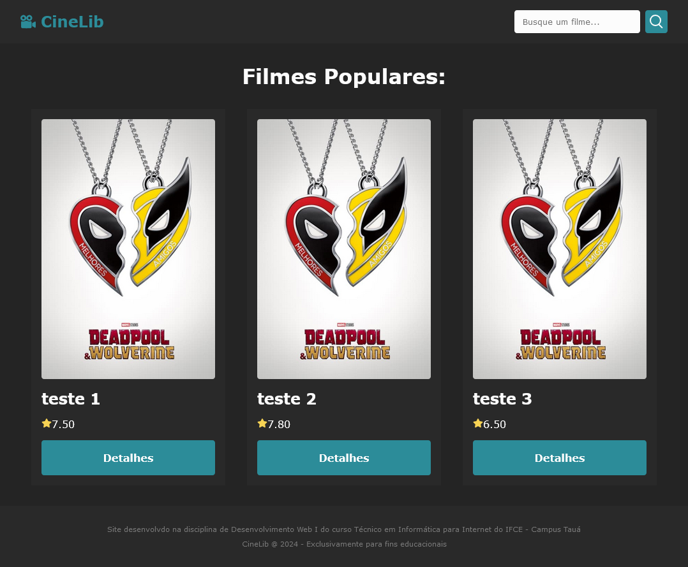

# Desenvolvimento Web I - Infonet 2024.1

## Roteiro de Prática

> **_Prática 01 - Projeto Final_** - *Migração do projeto CineLib para um projeto com React*
>
> - **Objetivo:** migrar todos os componentes do projeto CineLib já desenvolvidos para um projeto React e praticar os conceitos fundamentais do React.
> - **Observações e Instruções Gerais:**
>   - Tente seguir o roteiro desta prática de forma a entender cada passo.
>   - Caso fique com alguma dúvida, fique à vontade para perguntar.
>   - Você também pode verificar o código final da prática [neste link](cinelib-react-v1) (porém, entenda que esse é um recurso auxiliar, tente realizar a prática somente seguindo este roteiro).
>   - Nesta atividade, praticamente não criearemos código novo. Vamos pegar o código já existente no projeto CineLib (trabalhado em práticas anteriores), que utiliza somente HTML, CSS e JS puros, e migrar para uma apolicação React. Logo, vamos somente organizar os códigos na estrutura do projeto React e adaptar o que for necessário.

### 2. Criando o Projeto React no VS Code

> ❗ **Avisos:**
> - Se você for utilizar a plataforma online CodeSandBox, pode pular essa seção.
> - Vou explicar de forma mais objetiva aqui, pressumindo que vocês já entendem esse processo de criação do projeto e a estrutura básica criada. Em caso de dúvidas, consulte a prática <a href="./../../02_REACT/pratica-01-react/pratica01.md" target="_blank">"Prática React 01: Primeiros passos com React"</a>, realizada anteriormente.

1. Crie uma pasta para organizar as práticas do projeto final da disciplina, pode dar o nome de `projeto-final`

1. Abra essa pasta no VS Code e abra ela no terminal integrado do VS Code (botão direito na área da pasta no explorador de arquivos do VS Code)

1. Crie um novo projeto React com o comando `npm create vite@latest`, informando o nome do projeto como `cinelib-react-v1` e selecionando as opções React e depois, JavaScript.

1. Entre na pasta do projeto, pelo terminal integrado, usando o comando `cd cinelib-react-v1` (se tiver atribuído outro nome para o projeto, verifique qual foi e coloque o nome da pasta corretamente)

1. Instale as dependências iniciais do projeto com o comando `npm install`

1. Execute o projeto usando o comando `npm run dev` e deixe a aplicação aberta no navegador para ir conferindo o resultado

    - Perceba que ao executar o comando acima, o Vite gera um link de acesso à aplicação no navegador. Basta segurar a tecla CTRL e clicar sobre o link.
    - Caso queira finalizar a execução da aplicação, volte ao terminal integrado e aperte a combinação de teclas CTRL + C

<a id="secao03"></a>
### 3. Iniciando a Migração

> ❗ **Importante**
> - O código base do projeto CineLib se encontra <a href="./../cine-lib-base/" target="_blank">neste link</a>. Deixe esse link aberto em uma aba do navegador para pegar o código já desenvolvido a partir dele. 

1. Voltando ao projeto criado anteriormente, no arquivo `index.html` vamos:
    - definir o idioma da página para `pt-BR` 
    - alterar o título para `CineLib`
    - alterar o ícone da aplicação (que aparece na aba do navegador ao lado do título) para o logo da nossa aplicação
        - para isso, pegue o arquivo `cine-lib.svg` que está na pasta `img` do projeto base (aberto anteriormente) e coloque-o dentro da pasta `public` do projeto React criado na seção anterior
        - feito isso, modifique a linha `<link rel="icon" type="image/svg+xml" href="/vite.svg" />`, no arquivo `index.html`, alterando o nome do ícone `vite.svg` para `cine-lib.svg`
    - informar uma descrição da nossa aplicação com a seguinte tag a ser inserida na seção `head` do arquivo `index.html`: `<meta name="description" content="Confira os maiores sucessos do cinema mundial">`

1. Veja como deve ficar o arquivo `index.html`:

    ```html
    <!doctype html>
    <html lang="pt-BR">
      <head>
        <meta charset="UTF-8" />
        <link rel="icon" type="image/svg+xml" href="/cine-lib.svg" />
        <meta name="viewport" content="width=device-width, initial-scale=1.0" />
        <meta name="description" content="Confira os maiores sucessos do cinema mundial">
        <title>CineLib</title>
      </head>
      <body>
        <div id="root"></div>
        <script type="module" src="/src/main.jsx"></script>
      </body>
    </html>
    ```

1. Substitua todo o conteúdo do arquivo `/src/index.css` pelo nosso CSS global do projeto que se encontra no arquivo `index.css` do código base, com o seguinte conteúdo (pode copiar daqui mesmo 😉): 

    ```css
    :root {
      --bg-color: #242424;
      --text-color: #fcfcfc;
      --primary-color: #2C8C99;
      --hover-color: #326771;
      --star-color: #f7d354;
    }

    * {
        box-sizing: border-box;
        font-family: Verdana, Geneva, Tahoma, sans-serif;
        margin: 0;
        padding: 0;
    }

    body {
        background-color: var(--bg-color);
        color: var(--text-color);
    }

    a {
        color: var(--primary-color);
        text-decoration: none;
    }

    a:hover {
        color: var(--hover-color);
    }
    ```

1. Agora vamos limpar nosso arquivo do componente principal `/src/App.jsx`. Apague as importações que não vamos precisar (deixe somente a importação do arquivo `App.css`), modifique o corpo da função `App()` apagando a linha contendo `const [count, setCount] = useState(0)` e tudo que está dentro do fragment `<></>`. Além disso, vamos alterar definição da função `App()` para usar *arrow function*. Veja como deve ficar o código inicial do arquivo `App.jsx`:

    ```jsx
    import './App.css';

    const App = () => {
      return (
        <>
          
        </>
      );
    };

    export default App;
    ```

1. Ainda no arquivo `App.jsx` vamos definir a estrutura básica da página inicial, de acordo com o código base já criado. 
    - Observando o arquivo `index.html` do nosso código base, observamos que ele contém uma tag `header` com a barra de navegação, uma tag `main` com o conteúdo principal da página (os cards dos filmes) e uma tag `footer` para o rodapé. 
    - Como explicado no início deste roteiro, teremos 4 tipos de componentes: a própria página inicial (`App.jsx`), a barra de navegação, o rodapé e o componente que define os cards.
    - Vamos ter, então, um arquivo para definir o componente de barra de navegação, um arquivo para o rodapé e outro para os cards. Logo, no arquivo `App.jsx` só teremos o esqueleto básico da página com as referências para os demais componentes.
    - Dessa forma, o componente `App.jsx`, deve ficar assim:

    ```jsx
    import './App.css';

    const App = () => {
      return (
        <>
          aqui vai a barra de navegação...

          <main>
            <div className="container">

              <h2 className="title">Filmes Populares:</h2>

              <div className="movies-container">
                aqui vai os cards dos filmes...
              </div>

            </div>
          </main>

          aqui vai o rodapé...
        </>
      );
    };

    export default App;
    ```

    - Veja que deixamos alguns textos só para indicar onde devem ser colocados cada componente (que ainda não criamos)

1. Substitua o conteúdo do arquivo `/src/App.css` pelos estilos que devem ser aplicados à página inicial da aplicação. As regras de estilização estão no arquivo `home.css` do código base. Porém, não vamos pegar todo o conteúdo do arquivo, pois várias regras CSS contidas nele fazem referência aos Cards (elas vão estar em outro arquivo). O código CSS a ser colocado no arquivo `/src/App.css` é o seguinte:

    ```css
    .container .title {
      font-size: 2rem;
      text-align: center;
      margin: 2rem 1rem 0;
    }

    .movies-container {
      display: flex;
      flex-wrap: wrap;
      justify-content: space-around;
      padding: 2rem;
      max-width: 1200px;
      margin: 0 auto;
      row-gap: 2.5rem;
    }
    ```

### 4. Criando os Componentes NavBar e Footer

> ❗ **Importante**
> - Antes de mais nada, como vamos precisar das imagens estáticas dos ícones de pesquisa (que será usado na barra de navegação) e de estrela (que será usado nos cards), precisamos colocar esses recursos no nosso projeto.
> - Para isso, pegue os arquivos `search-icon.svg` e `star-icon.svg` que estão dentro da pasta `img` do código base (<a href="./../cine-lib-base/img/">acesse aqui</a>) e coloque-os dentro da pasta `/src/assets` do projeto React criado.

1. Agora que já temos a estrutura básica da página inicial, vamos criar nossos componentes para a barra de navegação, para os cards e para o rodapé. Para isso, vamos criar uma pasta chamada `components` dentro da pasta `src`.

1. Inicialmente vamos definir o componente para a barra de navegação:

   - Crie um arquivo chamado `NavBar.jsx` e outro chamado `NavBar.css` dentro da pasta `components` criada anteriormente
   - No arquivo `NavBar.jsx` vamos importar o arquivo de estilos: `import "./NavBar.css"`
   - Depois, vamos criar uma constante com o mesmo nome do arquivo (`NavBar`) para guardar a definição do componente com _arrow function_, criando a estrutura necessária ao componente.
      - Lembrando que a estrutura desse componente está no arquivo `index.html` do código base e, como já comentamos anteriormente, o código que define a barra de navegação é o código contido dentro da tag `header`.
   - Por fim, devemos exportar o componente para que possamos reutilizá-lo em outros locais.
   - O código final do componente `NavBar` é o seguinte:

   ```jsx
    import "./NavBar.css";
    import searchIcon from "./../assets/search-icon.svg";
    import cinelibLogo from "/cine-lib.svg";

    const NavBar = () => {
      return (
        <header>
          <nav id="navbar">
            <div id="brand">
              <a href="./index.html">
                
                <h2>CineLib</h2>
              </a>
            </div>
            <form action="" id="search-form">
              <input type="text" placeholder="Busque um filme..." />
              <button type="submit">
                
              </button>
            </form>
          </nav>
        </header>
      );
    };

    export default NavBar;
   ```

   - Perceba que as imagens do logo e do ícone de pesquisa foram importados como recursos. 
   - Já haviamos inserido a imagem do logo no projeto na pasta `public` (como explicado na [seção 03](#secao03) deste roteiro). Logo basta referenciar como `/cine-lib.svg` (tudo que está na pasta `public` pode ser acessado diretamente somente referenciando a pasta raíz `/`).
   - As demais imagens, colocadas em `/src/assets`, podem ser referenciadas usando o caminho relativo. Nesse caso, ficou `./../assets/search-icon.svg`, pois como o arquivo que faz a importação, `NavBar.jsx`, está na pasta `components`. Logo, precisamos voltar um nível de pasta (com `../`) para acessar a pasta `assets`.
   - Perceba também que na importação desses recursos, damos um nome (variável) para referenciá-los no código. Então, quando necessitamos referenciar a imagem do logo, por exemplo, dentro do código JSX, fazemos isso através da interpolação de código JavaScript: `{cinelibLogo}`.

1. Para finalizar o componente `NavBar`, vamos ao arquivo de estilos `NavBar.css` e inserir o conteúdo do arquivo `navbar.css` do código base do projeto, como mostrado a seguir: 
  
    ```css
    #navbar {
        display: flex;
        padding: 1rem 2rem;
        justify-content: space-between;
        align-items: center;
        background-color: #292929;
    }

    #brand a {
        display: flex;
        font-size: 1rem;
        column-gap: 0.5rem;
        align-items: center;
    }

    #brand img {
        width: 1.5rem;
    }

    #brand a:hover img {
        opacity: 0.7;
    }

    #search-form {
        display: flex;
        column-gap: 0.5rem;
    }

    #search-form input {
        padding: 0.2rem 0.8rem;
        border-radius: 4px;
        border: none;
        background-color: var(--text-color);
    }

    #search-form button {
        border-radius: 4px;
        background-color: var(--primary-color);
        padding: 0.3rem;
        display: flex;
        align-items: center;
        cursor: pointer;
        border: 2px solid var(--primary-color);
    }

    #search-form button:hover {
        background-color: var(--hover-color);
    }
    ```

1. Agora vamos à definição do componente relativo ao rodapé:

    - Crie os arquivos `Footer.jsx` e `Footer.css` dentro da pasta `components`
    - No arquivo `Footer.jsx` já importe o arquivo de estilos `Footer.css`, defina a estrutura básica do componente com uma **arrow function** e exporte o componente ao final.
    - A estrutura do rodapé é bastante simples, teremos apenas dois parágrafos dentro de um elemento `footer` (como definido no código base do projeto). Veja como deve ficar o código do arquivo `Footer.jsx`:

      ```jsx
      import "./Footer.css";

      const Footer = () => {
        return (
          <footer>
            <p>Site desenvolvdo na disciplina de Desenvolvimento Web I do curso Técnico em Informática para Internet do IFCE - Campus Tauá</p>
            <p>CineLib @ 2024 - Exclusivamente para fins educacionais</p>
          </footer>
        );
      };

      export default Footer;
      ```

1. Da mesma forma, vamos inserir dentro do arquivo `Footer.css` as regras de estilização para o rodapé, que estão no arquivo `footer.css` do código base, como apresentado a seguir:

    ```css
    footer {
        text-align: center;
        font-size: 0.7rem;
        padding: 30px;
        background-color: #292929;
        display: flex;
        flex-direction: column;
        row-gap: 10px;
    }

    footer p {
        color: #777;
    }
    ```

1. Para finalizar esta seção, vamos importar para o arquivo `App.jsx` os componentes criados e colocá-los nos locais correspondentes. O código atualizado para o arquivo `App.jsx` deve ficar assim:

    ```jsx
    import './App.css';

    import NavBar from './components/NavBar';
    import Footer from './components/Footer';

    const App = () => {
      return (
        <>
          <NavBar />

          <main>
            <div className="container">

              <h2 className="title">Filmes Populares:</h2>

              <div className="movies-container">
                aqui vai os cards dos filmes...
              </div>

            </div>
          </main>

          <Footer />
        </>
      );
    };

    export default App;
    ```

### 5. Criando o componente Card

1. Crie os arquivos correspondentes ao componente Card dentro da pasta `components` (`Card.jsx` e `Card.css`)

1. Faça a imortação do arquivo de estilos `Card.css` dentro do arquivo `Card.jsx`

1. Defina o component `Card` com uma *arrow function*, como feito para os componentes anteriores, e exporte o componente ao final

1. No arquivo `index.html` do código base (<a href="./../cine-lib-base/index.html" target="_blank">acesse aqui</a>, caso necessário) você vai encontrar a estrutura básica do componente card (a div com classe `movie-card` com seus elementos internos).

1. O código final do componente `Card` deve ficar assim:

    ```jsx
    import "./Card.css";
    import starIcon from "./../assets/star-icon.svg";

    const Card = ( { filme } ) => {
      return (
        <div className="movie-card">
            
            <h2>{filme.title}</h2>
            <p>
                 {filme.vote_average.toFixed(2)}
            </p>
            <a href="">Detalhes</a>
        </div>
      );
    };

    export default Card;
    ```

    - Explicando:
        - Como vamos precisar do ícone de estrela no componente Card, fazemos a importação do arquivo `star-icon.svg` da forma como explicado anteriormente
        - Perceba que neste componente, estamos **usando o conceito de _Props_** do React. Na definição da *arrow function* para o componente, estamos definindo um parâmetro chamado `filme`, que é o nosso elemento **props**, ou seja, o que o componente Card precisa receber de dados para renderizar seus elementos.
        - Essa **prop** nada mais é do que um objeto filme, que é retornado pela API do TMDB (mais adiente explico como fazer isso no React).
        - É importante entender que os atributos desse objeto são definidos na API do TMDB e devemos respeitar seus nomes para referenciá-los (por exemplo, para pegar a imagem de divulgação, usamos o atributo `poster_path`).
        - Por fim, vale lembrar que um componente React é definido com `JSX` (extensão da linguagem JavaScript), que permite "misturar" código HTML com JavaScript. Assim, quando queremos declarar um código JavaScript no meio do código HTML, precisamos delimitar com chaves `{}`, como mostrado no código acima, por exemplo, para pegar os valores dos atributos da **props** `filme`.

1. Agora, para concluir a definição do componente `Card` basta inserir as regras de estilização desse componente no arquivo `Card.css`. As regras CSS para esse componente estão no arquivo `home.css` do código base, mas trago ele a seguir:

    ```css
    .movie-card {
        width: 30%;
        min-width: 200px;
        display: flex;
        flex-direction: column;
        justify-content: space-between;
        background-color: #292929;
        padding: 1rem;
        row-gap: 1rem;
        transition: all .5s;
    }

    .movie-card > img {
        max-width: 100%;
        border-radius: 4px;
    }

    .movie-card a {
        background-color: var(--primary-color);
        color: #fcfcfc;
        border: 2px solid var(--primary-color);
        border-radius: 4px;
        padding: 1rem 0.5rem;
        text-align: center;
        font-weight: bold;
        transition: all 0.5s;
    }

    .movie-card a:hover {
        background-color: #fcfcfc;
        color: var(--primary-color);
    }

    .movie-card:hover {
        transform: scale(1.05);
    }
    ```

1. Para testar se o componente foi definido de forma correta, vamos simular dados de filmes antes de implementar a chamada à API.

    - Volte ao arquivo `App.jsx` e crie um arry de objetos após a seção de `imports` e antes da definição da *arrow function* do componente. Veja um exemplo de dados em um array de objetos e ó código completo do arquivo `App.jsx`:

      ```jsx
      import './App.css';

      import NavBar from './components/NavBar';
      import Footer from './components/Footer';
      import Card from './components/Card';

      const filmes = [
        {
          id: 1,
          title: "teste 1",
          poster_path: "/xq4v7JE8niZ75OYYPDGNn6Gzpyt.jpg",
          vote_average: 7.5
        },
        {
          id: 2,
          title: "teste 2",
          poster_path: "/xq4v7JE8niZ75OYYPDGNn6Gzpyt.jpg",
          vote_average: 7.8
        },
        {
          id: 3,
          title: "teste 3",
          poster_path: "/xq4v7JE8niZ75OYYPDGNn6Gzpyt.jpg",
          vote_average: 6.5
        },
      ];

      const App = () => {
        return (
          <>
            <NavBar />

            <main>
              <div className="container">

                <h2 className="title">Filmes Populares:</h2>

                <div className="movies-container">
                  {filmes.map((filme) => (
                    <Card key={filme.id} filme={filme} />
                  ))}
                </div>

              </div>
            </main>

            <Footer />
          </>
        );
      };

      export default App;
      ```

    - Veja que importamos o arquivo `Card.jsx` para usar o componente `Card` e definimos um array de objetos com dados fictícios de filmes. 
    - Além disso, dentro da div de classe `movies-container`, implementamos a lógica necessára para percorrer todo o array de filmes com o método `map`:
      - em cada iteração, chamamos o elemento atual do array de `filme` e inserimos um componente `Card` passando o `id` do filme para o atributo `key` (atributo obrigatório no React quando criamos uma lista de um mesmo componente)
      - passamos também o objeto `filme` como **props** para o componente (lembre que o componente `Card` recebe uma **prop** com nome `filme`).
    
    - Isso já deve ser suficiente para obtermos o seguinte resultado:

    <div style="width: 90%; margin: 0 auto">
      
    </div>

    - Veja que já temos a interface da nossa aplicação como ela deve ser. Falta agora fazer a chamada à API do TMDB e popular os cards com as informações retornadas pela API. É isso que vamos fazer na próxima seção 😉.

### 6. Seção Final (Integrando a API do TMDB)

1. Agora vamos trabalhar com um recurso muito importante do React: `hooks`

    - Os hooks no React são funções que permitem o uso de vários recursos do React de forma simples e possibilitam gerenciar estados da aplicação. Veja mais [aqui](https://www.alura.com.br/artigos/react-hooks).
    - Pense nos hooks como códigos prontos que nos permitem executar ações que sem eles seriam bastante trabalhosas. Com os hooks, podemos gerenciar dados da nossa aplicação, acessar informações em diversas partes dela (através de contextos) e gerenciar melhor requisições a APIs, renderização de componentes e uso de memória.

1. No nosso arquivo `App.jsx`, vamos apagar o arrar de objetos `filmes` criados anteriormente para teste

1. Vamos criar duas constantes, logo após a área dos `imports`: uma para definir um objeto `options` com a configuração da requisição à API do TMDB (método e token de acesso); e outra para guardar a URL base para a requisição de filmes populares à API
    - Esses dados estão no arquio `main.js` do código base

1. O código do arquivo `App.jsx` vai ficar assim: 

    ```jsx
    import './App.css';

    import NavBar from './components/NavBar';
    import Footer from './components/Footer';
    import Card from './components/Card';

    const options = {
      method: 'GET',
      headers: {
          accept: 'application/json',
          Authorization: 'Bearer SEU_TOKEN'
      }
    };

    const URL_FETCH = "https://api.themoviedb.org/3/discover/movie?include_adult=false&include_video=false&language=pt-BR&page=1&sort_by=popularity.desc";

    const App = () => {
      return (
        <>
          <NavBar />

          <main>
            <div className="container">

              <h2 className="title">Filmes Populares:</h2>

              <div className="movies-container">
                {filmes.map((filme) => (
                  <Card key={filme.id} filme={filme} />
                ))}
              </div>

            </div>
          </main>

          <Footer />
        </>
      );
    };

    export default App;
    ```

    - Lembre-se de trocar `SEU_TOKEN`, no atributo `Authorization` pelo seu token de acesso à API do TMDB
    - Nesse ponto, provavelmente sua aplicação estará indicando um erro (é normal, pode seguir)

1. Agora vamos definir uma variável de estado para armazenar os dados dos filmes que a API retornar. Para isso, vamos usar o hook `useState()`. Com ele, definimos o nome de estado (variável) e o nome de uma função para alterar esse estado. No nosso caso, vai ficar assim: `const [filmes, setFilmes] = useState([])`
    - O código acima deve ser inserido logo acima do `return` da função do componente `App.jsx`
    - Aqui estamos definindo umestado chamado `filmes` e uma função para açterar esse estado chamada `setFilmes`

1. Por fim, vamos usar o hook `useEffect` para possibilitar sincronizar nossa aplicação com a API do TMDB, executando a função `fetch` (de envio da requisição) sempre que o componente for re-renderizado. A sintaxe é apresentada a seguir e o código deve ser colocado abaixo da definição do estado (feito no passo anterior) e antes do `return` co componente. Veja como deve ficar o código final do arquivo `App.jsx`:

    ```jsx
    ...
    const App = () => {

      const [filmes, setFilmes] = useState([]);

      useEffect(() => {
        const buscarFilmes = async () => {

          try {
            
            const dados = await fetch(URL_FETCH, options).then((resposta) => resposta.json());
            setFilmes(dados.results);
            
          } catch (error) {
            console.log("Erro ao buscar filmes: ", error);
          }

        };

        buscarFilmes();
      }, []);

      return (
        <>
          <NavBar />

          <main>
            <div className="container">

              <h2 className="title">Filmes Populares:</h2>

              <div className="movies-container">
                {filmes.map((filme) => (
                  <Card key={filme.id} filme={filme} />
                ))}
              </div>

            </div>
          </main>

          <Footer />
        </>
      );
    };

    export default App;
    ```

    - O código acima da linha `const App = () => {` foi omitido (não mudou)
    - Explicando o código dentro do `useEffect()`:
        - O `useEffect()` recebe dois parâmetros, uma função que será exeutada e um array de dependências que especifica algum elemento que será verificado para saber se a função dentro do `useEffect` deve ou não ser executada.
        - Basicamente criamos uma função assíncrona chamada `buscarFilmes()` que envia uma requisição à API do TMDB (da forma como já fizemos em práticas passadas)
        - Quando os dados da API são retornados, guardamos em uma constante chamada `dados` e depois usamos a função `setFilmes` para alterar o estado `filmes` definido com o `useState`
        - Isso faz com que o estado `filmes` mude e o React entenda que deve atualizar a interface com os novos dados recebidos
        - Depois da definição da função `buscarFilmes`, simplesmente chamamos ela para ser executada
        - Por fim, o array de dependências passado para o `useEffect` está vazio (`[]`). Isso se deve ao fato de não ter nenhum dado/estado sendo verificado, ou seja, sempre que o componente for re-renderizado, o `useEffect` será executado e buscará os filmes.